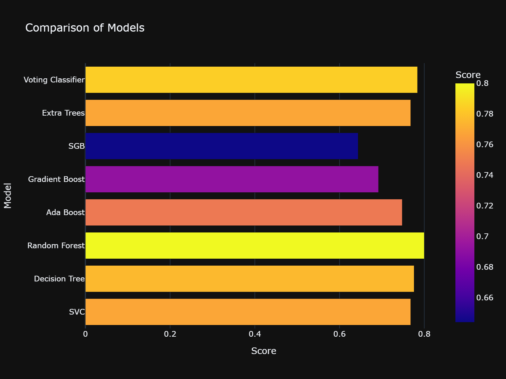

# 🚗 Auto Insurance Claims Fraud Detection

This project identifies potentially fraudulent auto insurance claims using machine learning techniques. It includes data preprocessing, exploratory data analysis (EDA), model building, evaluation, and a final comparison of various classifiers.

## 📂 Project Structure
AUTO_INSURANCE_CLAIMS/
├── dataset/ 
│ └── insurance_claims (1).csv 
├── EDA/ 
│ ├── authorities_contacted_total_claim_amount_median.png 
│ ├── confusion_matrix_ada_boost.png 
│ ├── confusion_matrix_dtc_tuned.png 
│ ├── confusion_matrix_dtc.png 
│ ├── confusion_matrix_etc.png 
│ ├── confusion_matrix_gbdt.png 
│ ├── confusion_matrix_rf_tuned.png 
│ ├── confusion_matrix_sgbt.png 
│ ├── confusion_matrix_svm.png 
│ ├── correlation_heatmap.png 
│ ├── distribution_plots.png 
│ ├── fraud Report distribution based on insured gender.png 
│ ├── fraud_reported_distribution.png 
│ ├── missing_values_matrix.png 
│ ├── model_comparison.png 
│ ├── police_report_available_total_claim_amount_median.png 
│ ├──FraudCase_Output.png
│ ├──NonFraudCase_Output.png
│ └── property_damage_total_claim_amount_median.png 
├── templates
│ └──index.html
├──.gitignore
├── main.py 
├── flask_api.py (frontend + prediction) 
├── test.py
├── model
│ ├── best_model.pkl
│ ├── scaler.pkl # All model training, preprocessing & evaluation
├── requirements.txt
└── README.md

## 📊 Features

- Missing value imputation using mode
- Feature engineering (`total_claim` = sum of all claim types)
- Encoding categorical features using one-hot encoding
- Multicollinearity check using correlation heatmap
- Model training and comparison:
  - SVM
  - Decision Tree (with GridSearchCV)
  - Random Forest
  - AdaBoost (with tuning)
  - Gradient Boosting
  - Stochastic Gradient Boosting
  - Extra Trees
  - Voting Classifier

## 🧪 Results

All models were evaluated based on **test accuracy** and **confusion matrices**. Below is a comparison of model performances:

## 💡 Highlights

- Feature Reduction: Removed redundant ID/date/location fields
- Combined related claim features to form `total_claim`
- GridSearchCV used for best hyperparameters
- Voting classifier used for ensemble prediction

---

## 🚀 Next Steps

- Deploy a user-facing prediction UI using **Flask**
- Accept form inputs (e.g., claim info) and return prediction (Fraud or Not Fraud)
- Log user inputs and prediction results

---

## 💻 Setup Instructions

## 1. Clone the repository:

git clone https://github.com/Decadent-tech/auto-insurance-fraud.git
cd auto-insurance-fraud

## 2. Install requirements:

pip install -r requirements.txt

## 3. Run the model script:

python models.py
## 4. Run Flask App:

python app.py

## 💡 Try a Known Fraud Case
Access: http://127.0.0.1:5000/fraudtest

## ⚙️ Dependencies
pandas, numpy, matplotlib, seaborn
plotly, scikit-learn
missingno
kaleido (for saving plotly images)

## ✍️ Author
Your Name — LinkedIn • GitHub

## 📄 License
MIT License
